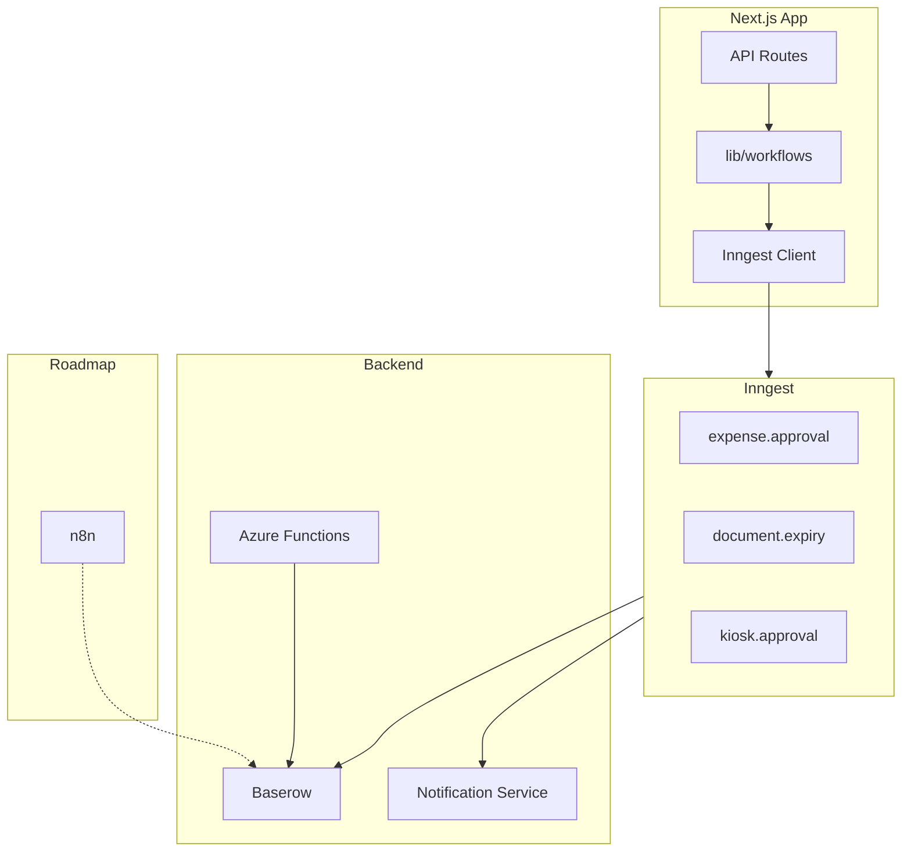

# ADR-009: Workflow Orchestration Strategy

**Status:** Accepted  
**Date:** 2026-02-25  
**Deciders:** Technical Lead, Architecture Team

---

## Context

House of Veritas has multiple workflow patterns scattered across the stack:

- **Business workflows:** Expense approval, manager approval (kiosk), document e-signature
- **Timer-based workflows:** Document expiry alerts, recurring tasks, overtime calculation, leave balance updates
- **Event-driven workflows:** DocuSeal webhook → Baserow sync, expense notification on pending

Current implementation uses ad-hoc logic in Next.js API routes, Azure Functions (Python), and an in-memory event store. No unified orchestration, durable execution, retries, or workflow audit trail. Roadmap envisions "Workflow Automation Builder" (n8n or custom) for business-user rules.

---

## Decision Drivers

1. **Reliability** — Workflows must complete despite transient failures; retries and durability matter
2. **Operational fit** — Align with Next.js/TypeScript primary stack; minimize Python-only logic where possible
3. **Cost** — Target <R950/month; prefer self-hosted or low-cost cloud options
4. **Simplicity** — Lower setup and maintenance overhead preferred
5. **Roadmap alignment** — Support future visual workflow builder (n8n) for business rules
6. **Audit** — Workflow state and history for compliance and debugging

---

## Primary Orchestration Choice: Weighted Decision Matrix

**Criteria** (weights sum to 100):

| Criterion | Weight | Description |
| --------- | ------ | ----------- |
| Reliability/durability | 25 | Retries, at-least-once delivery, failure recovery |
| Operational fit | 20 | Works with Next.js, TypeScript, existing Azure infra |
| Setup complexity | 15 | Time to deploy and maintain |
| Cost | 15 | Self-host or low cloud cost |
| Event-driven model | 10 | Fits webhook/timer/API-triggered patterns |
| Roadmap compatibility | 10 | Complements n8n for business-user rules |
| Audit/observability | 5 | Workflow history, status, debugging |

**Options scored 1–5** (5 = best):

| Criterion | Inngest | Temporal | Trigger.dev | Azure Durable Functions | Status quo |
| --------- | ------- | -------- | ----------- | ----------------------- | ---------- |
| Reliability/durability | 5 | 5 | 5 | 4 | 1 |
| Operational fit | 5 | 4 | 5 | 3 | 5 |
| Setup complexity | 5 | 2 | 4 | 3 | 5 |
| Cost | 5 | 4 | 5 | 4 | 5 |
| Event-driven model | 5 | 4 | 5 | 4 | 3 |
| Roadmap compatibility | 5 | 4 | 5 | 3 | 4 |
| Audit/observability | 5 | 5 | 4 | 4 | 1 |
| **Weighted total** | **4.95** | **4.05** | **4.75** | **3.55** | **3.35** |

**Primary orchestration decision:** **Inngest** — Best weighted score, event-driven, low setup, Next.js native, self-host or cloud.

---

## Secondary: Workflow Layer and n8n

### Workflow Layer (Separate Module)

| Criterion | Weight | Dedicated layer | Inline in APIs | Azure Functions only |
| --------- | ------ | --------------- | -------------- | ------------------- |
| Centralized audit | 25 | 5 | 2 | 3 |
| Consistency | 25 | 5 | 3 | 2 |
| Maintainability | 20 | 5 | 2 | 3 |
| Migration effort | 15 | 3 | 5 | 4 |
| Testability | 15 | 5 | 3 | 3 |
| **Weighted total** | | **4.55** | **2.85** | **2.75** |

**Decision:** **Dedicated workflow layer** — Introduce `lib/workflows/` to define schemas, centralize approval logic, route events to Inngest. Single place for audit and observability.

### Business-User Rules (Roadmap)

| Criterion | Weight | n8n | Custom engine | Inngest-only |
| --------- | ------ | --- | ------------- | ------------ |
| No-code/low-code | 30 | 5 | 2 | 1 |
| Integration breadth | 25 | 5 | 3 | 4 |
| Roadmap alignment | 20 | 5 | 3 | 3 |
| Ops complexity | 15 | 4 | 2 | 5 |
| Cost | 10 | 5 | 2 | 5 |
| **Weighted total** | | **4.65** | **2.55** | **3.35** |

**Decision:** **n8n** — Defer to roadmap (18–24 months). Use for business-user rules (e.g. "If expense >R5,000, require additional approval"). Complements Inngest for dev-defined workflows.

---

## Decisions Summary

| Decision | Choice | Rationale |
| -------- | ------ | ---------- |
| Primary orchestration | **Inngest** | Best weighted score; event-driven; Next.js native |
| Workflow abstraction | **Dedicated layer** | Central audit, consistency, maintainability |
| Business-user rules | **n8n** (roadmap) | Visual builder; no-code; roadmap-aligned |
| Azure Functions | **Retain for now** | Keep Python logic (OvertimeCalculator BCEA); migrate gradually |

---

## Target Architecture

---

## Consequences

### Positive

- Durable execution with automatic retries for workflow steps
- Centralized workflow definitions and audit trail
- Event-driven model aligns with webhooks, timers, and API triggers
- Inngest works with Next.js without new infrastructure
- n8n reserved for business-user rules per roadmap

### Negative

- New dependency (Inngest) and workflow layer to maintain
- Migration effort for existing ad-hoc workflows
- Azure Functions remain for Python-heavy logic until gradual migration

### Risks

- Inngest self-hosted requires additional infra; cloud option has cost
- n8n adoption deferred — no immediate visual workflow builder

---

## Implementation Order

1. **Add Inngest** — Install Inngest client; configure dev server and production endpoint
2. **Create workflow layer** — `lib/workflows/` with schema types and event routing
3. **Migrate kiosk approval** — First workflow: `request.submitted` → notify manager → (human) approve/reject → notify employee
4. **Wire expense API** — Emit `approval_required` to event store; add Inngest `expense.created` flow
5. **Migrate document expiry** — Replace or augment DocumentExpiryAlert with Inngest cron + step functions
6. **Defer n8n** — Align with Workflow Automation Builder phase (roadmap)

---

## References

- [Technical Design](01-technical-design.md)
- [Persistence Strategy ADR](05-persistence-strategy-adr.md)
- [Roadmap — Workflow Automation Builder](../05-project/02-roadmap.md)
- `lib/realtime/event-store.ts`, `app/api/kiosk/requests/route.ts`, `app/api/expenses/route.ts`
- `config/azure-functions/` (DocumentExpiryAlert, ExpenseNotification, DocuSealWebhook)
